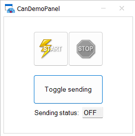

# Connecting a QEMU image with a SocketCAN Interface to SIL Kit

This demonstration illustrates the utilization of the SIL Kit vCAN Adapter to establish a connection between a QEMU image equipped with a SocketCAN Interface and the Vector SIL Kit.

A comprehensive, step-by-step guide is provided to generate CAN traffic from within a QEMU image, which is then routed through a CAN interface provided by the QEMU image itself. The adapter is designed to manage this traffic, ensuring that CAN frames are efficiently transmitted to and from the SIL Kit CAN network.

## Setting up the QEMU image

### 1- Building the QEMU image
Follow the steps in [this section](https://github.com/vectorgrp/sil-kit-adapters-qemu/tree/main/tools) of the SIL Kit QEMU Adapter to to build the QEMU image.

**Note:** You should clone the whole repository in order to get all necessary helper files.  

### 2- Exposing a SocketCAN Interface in the QEMU image
After building the QEMU image, modify the `path/to/sil-kit-adapters-qemu/tools/run-silkit-qemu-demos-guest` file by adding the following lines at the end:

**Note:** Do not forget to add a backslash "`\`" at the end of the existing file before adding the new lines, otherwise these new lines will not be taken into account. 

```
  -object can-bus,id=canbus0 \
  -object can-host-socketcan,id=canhost0,if=can0,canbus=canbus0 \
  -device kvaser_pci,canbus=canbus0
```

This creates a virtual CAN bus `canbus0` which can be connected to the host system using the SocketCAN protocol, through the `can0` interface.

### 3- Running the QEMU image 
In order to run the QEMU image, a `can0` vCAN device needs to be up and running on the host. 
This can be done by executing the following commands:

```
  sudo ip link add dev can0 type vcan
  sudo ip link set up can0
```
After that, run the QEMU image as follows: 
```
  /path/to/sil-kit-adapters-qemu/tools/run-silkit-qemu-demos-guest
```

**Note:** Installing `can-utils` on your QEMU image is necessary because these command line tools are useful to manipulate CAN frames for this demonstration. 
You can install them as follows:
```
  apt update
  apt install can-utils 
```

### 4- Setting up a CAN device inside the QEMU image 
Once you are logged in to the QEMU image, configure the `can0` CAN device and set up as follows:
```
  ip link set can0 type can bitrate 1000000
  ip link set can0 up
```

## Running the Demo Applications
Now is a good point to start the `sil-kit-registry` on your Linux host:

    /path/to/SilKit-x.y.z-$ubuntu/SilKit/bin/sil-kit-registry --listen-uri 'silkit://0.0.0.0:8501'

After that, launch the SilKitAdapterSocketCAN on the Linux host as well:

    ./bin/SilKitAdapterSocketCAN --configuration ./SocketCAN/demos/SilKitConfig_Adapter.silkit.yaml

You should see the following output in the terminal where the adapter was launched: 

    [date time] [SilKitAdapterSocketCAN] [info] Creating participant 'SilKitAdapterSocketCAN' at 'silkit://localhost:8501', SIL Kit version: 4.0.45
    ...
    [date time] [SilKitAdapterSocketCAN] [info] Creating CAN controller 'SilKitAdapterSocketCAN_CAN_CTRL'
    ...
    [date time] [SilKitAdapterSocketCAN] [info] vCAN device [can0] successfully opened
    [date time] [SilKitAdapterSocketCAN] [info] Created CAN device connector for [can0] on network [CAN1]


You should also see a `SilKitAdapterSocketCAN` participant announcement in the SIL Kit registry terminal

    [date time] [SilKitRegistry] [info] Sending known participant message to SilKitAdapterSocketCAN, protocol version 3.1

When the previous steps are done, your set up looks like the following and the SIL Kit vCAN Adapter is connected on the SIL Kit `CAN1` network:

    +------------------------------------------------------------------------+
    |Linux Host                                                . . . . . . . |
    |                                       +------------+     .           . | 
    |                                       |   SIL Kit  |     .  SIL Kit  . |
    | +-------------------------------+     |    vCAN    <----->   CAN1    . |
    | |QEMU Image                     |     |   Adapter  |     .  network  . |
    | |                               |     +------ʌ-----+     .           . |
    | |                               |            |           . . . . . . . |
    | |                               |            |                         |    
    | |          +--------------+-----+----+-------v-----+                   |
    | |          |              |   QEMU   |             |                   |
    | |          |  CAN device  |SocketCAN | vCAN device |                   |
    | |          |     can0     |Interface |    can0     |                   |
    | |          +--------------+-----+----+-------------+                   |
    | |                               |                                      |
    | +-------------------------------+                                      |
    |                                                                        |
    +------------------------------------------------------------------------+

At this point, if you generate some CAN frames on the `can0` CAN device from the QEMU image, these frames will propagate via the SIL Kit vCAN Adapter through to `CAN1` SIL Kit network.
Launch the following command on the QEMU terminal to generate 300 frames:

```
for (( i = 1; i <= 300 ; i++ )); do
cansend can0 001#AAAABBBB
sleep 0.5
done
```
Any SIL Kit participants connected to the same SIL Kit `CAN1` network will be able to exchange CAN frames from `can0` vCAN device.   

In a separate Terminal, launch the CanEchoDevice. This will connect it to SIL Kit's `CAN1` network by default.
```
./bin/SilKitDemoCanEchoDevice --log Debug
```
You should see the following output in the terminal after launching the CanEchoDevice:
```
[date time] [CanEchoDevice] [info] Creating participant 'CanEchoDevice' at 'silkit://localhost:8501', SIL Kit version: 4.0.36
[date time] [CanEchoDevice] [info] Connected to registry at 'tcp://127.0.0.1:8501' via 'tcp://127.0.0.1:35464' (silkit://localhost:8501)
[date time] [CanEchoDevice] [info] Creating CAN controller 'CanEchoDevice_CAN1'
Press CTRL + C to stop the process...
....
[date time] [CanEchoDevice] [debug] SIL Kit >> Demo: CAN frame (4 bytes)
[date time] [CanEchoDevice] [debug] SIL Kit >> CAN : ACK for CAN Message with transmitId=1
[date time] [CanEchoDevice] [debug] Demo >> SIL Kit : CAN frame (dlc=4 bytes, txId=1)
[date time] [CanEchoDevice] [debug] SIL Kit >> Demo: CAN frame (4 bytes)
[date time] [CanEchoDevice] [debug] SIL Kit >> CAN : ACK for CAN Message with transmitId=2
[date time] [CanEchoDevice] [debug] Demo >> SIL Kit : CAN frame (dlc=4 bytes, txId=2)
...
```
You should also see a `CanEchoDevice` participant announcement in the SIL Kit registry terminal:
```
[date time] [CanEchoDevice] [info] Creating participant 'CanEchoDevice' at 'silkit://localhost:8501', SIL Kit version: 4.0.45
```
**Note:**  The CanEchoDevice is a SIL Kit participant on CAN1 network that echoes back CAN messages it receives after incrementing the received CAN ID by 1 and shifitng the data field by one byte to the left.

## Monitoring CAN data generated on `can0` vCAN device  
You can read the CAN frames that are transmitted by the QEMU image on Linux host, as they are fedthrough to the `can0` vCAN device on the host side throught the CAN Interface provided by the QEMU image. To do this you can use the following command in a Terminal on your Linux host:
```
candump can0
```
If both the previously-mentioned `cansend` loop and the `CanEchoDevice` are running along with the SilKitAdapterSocketCAN, you should see output similar to the following in the terminal:
```
can0  001   [4]  AA AA BB BB
can0  002   [4]  AA BB BB 00
can0  001   [4]  AA AA BB BB
can0  002   [4]  AA BB BB 00
. 
.
```
As described earlier, CAN messages with ID of 001 are the ones sent from the QEMU image. On the other hand, the ones with ID 002 have been sent back from the CanEchoDevice after increasing ID by `1` and applying a shift-left of data by one byte.  

### Adding CANoe (16 SP3 or newer) as a participant
If CANoe is connected to the SIL Kit, all CAN traffic is visible there as well. You can also execute a test unit which checks if the CAN messages are being transmitted as expected.

Before you can connect CANoe to the SIL Kit network you should adapt the `RegistryUri` in `./SocketCAN/demos/CANoe_SILKit_config.silkit.yaml` to the IP address of your system where your sil-kit-registry is running. 
The configuration file is referenced by both following CANoe use cases (Desktop Edition and Server Edition).

### CANoe Desktop Edition
Load the `CANoe_vCAN_configuration.cfg` from the `./SocketCAN/demos/CANoe` directory and start the measurement. Optionally you can also start the test unit execution of included test configuration.
While the demo is running these tests should be successful.

### CANoe4SW Server Edition (Windows)
You can also run the same test set with `CANoe4SW SE` by executing the following powershell script `./SocketCAN/demos/CANoe4SW_SE/run.ps1`. 
The test cases are executed automatically and you should see a short test report in powershell after execution.

### CANoe4SW Server Edition (Linux)
You can also run the same test set with `CANoe4SW SE (Linux)`. At first you have to execute the powershell script `./SocketCAN/demos/CANoe4SW_SE/createEnvForLinux.ps1` on your windows system by using tools of `CANoe4SW SE (Windows)` to prepare your test environment for Linux. 
In `./SocketCAN/demos/CANoe4SW_SE/run.sh` you should adapt `canoe4sw_se_install_dir` to the path of your `CANoe4SW SE` installation in your Linux system. Afterwards you can execute `./SocketCAN/demos/CANoe4SW_SE/run.sh` in your Linux system. The test cases are executed automatically and you should see a short test report in your terminal after execution.

## Generating CAN data in CANoe Desktop Edition 
This is done with the same previous setup, but instead of generating CAN traffic inside the QEMU image, CANoe Desktop Edition is the source of CAN payload.  

You can start generating CAN frames in CANoe Desktop Edition using the CanDemoPanel: 



After starting the measurement, click on the `Toggle sending` button to start sending CAN frames on SIL Kit CAN1 network. The outgoing CAN frames have an ID of `0C8` and hold `87 65 43 21` data.

You can read data that is available on the `can0` vCAN device inside the QEMU image by using:
```
candump can0
```
If the CanEchoDevice is running along with the SilKitAdapterSocketCAN, you should see output similar to the following in the terminal:
``` 
can0  0C8   [4]  87 65 43 21
can0  0C9   [4]  65 43 21 00
can0  0C8   [4]  87 65 43 21
can0  0C9   [4]  65 43 21 00
. 
.
```
As described earlier, CAN messages with ID of 0C8 are the ones sent from CANoe Desktop Edition and the ones with ID 0C9 are the response of the CanEchoDevice to those frames, after increasing their ID by `1` and applying a shift-left of data by one byte. 

