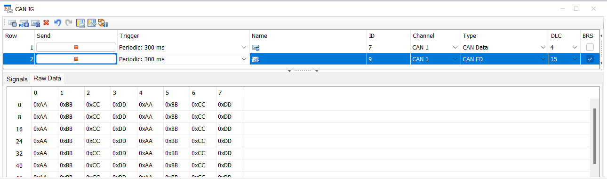

# SocketCAN Demo and Adapter Setup
This demo consists of SocketCAN interface `can0` which is connected to SIL Kit via `sil-kit-adapter-vcan`, with the latter being a SIL Kit participant connected to `CAN1` SIL Kit network. 
For demonstration purposes, another SIL Kit participant `CanEchoDevice` is connected to the same `CAN1` SIL Kit network.   

First, a virtual CAN interface (SocketCAN) is set up in Linux using a shell script. Then, the `sil-kit-adapter-vcan` is launched, binding to the virtual CAN interface from one side and connecting to SIL Kit as a participant from the other. 
After that the `sil-kit-demo-can-echo-device` is launched and its connection to SIL Kit is established. 
When all the connections are set up, a shell script is run to generate CAN payload on `can0` SocketCAN interface. 

The following sketch shows the general setup: 

    +------------[ Virtual CAN ]--------------+                      +-----[ SIL Kit Adapter SocketCAN ]-----+
    |-CAN payload generation on [can0]        <----- SocketCAN ------>    connecting SocketCAN [can0] to     |
    |-Sending & receiving on [can0] interface |                      |          SIL Kit [CAN1] Network       |
    +-----------------------------------------+                      +------ʌ--------------------------------+
                                                                            |            
                                                                            |           
                                                                     +------|------[ SIL Kit ]---------------+
                                                                     |      |                                |
                                                                     |  +---v---[ CAN1 Network ]----------+  |
    +-------------[ CanEchoDevice ]-----------+                      |  |                                 |  |
    |                                         <----------------------|-->     Peer-to-peer connection     |  |
    +-----------------------------------------+                      |  |     between participants on     |  |
    +-------------[ Vector CANoe ]------------+                      |  |     SIL Kit [CAN1] Network      |  |
    |-CAN payload generation on SIL Kit       <----------------------|-->                                 |  |
    |             [CAN1] network              |                      |  +---------------------------------+  |
    +-----------------------------------------+                      |                                       |

## sil-kit-demo-can-echo-device

This demo application implements a very simple SIL Kit participant that connects to the SIL Kit `CAN1` network, to which both the SocketCAN Adapter and CANoe can connect as SIL Kit 
participants in order to exchange CAN frames. The `sil-kit-demo-can-echo-device` responds to CAN messages it receives on `CAN1` network by incrementing the received CAN ID by `1` and shifitng the data field by one byte to the left, then sending it back on the same `CAN1` network.

# Running the Demos

## SocketCAN interface setup and CAN traffic generation in Linux
First, run the following command in the Terminal to load the necessary Linux kernel modules and setup a virtual CAN interface named `can0`.

    sudo ./SocketCAN/demos/shell_scripts/setup_vCAN_device.sh can0

You should see this output that indicates that the `can0` virtual CAN device has been successfully launched:
    
    Loading vCAN kernel module
    Device "can0" does not exist.
    Setting up [can0] with MTU=72
    vCAN interface [can0] is up & running.

> Optionally, you can pass the `-mtu16` flag to the script, which will set the MTU (Maximum Transmission Unit) of the opened vCAN device to 16. More on this can be found in the [SocketCAN documentation](https://docs.kernel.org/networking/can.html).

Now, you can start sending virtual CAN frames from your terminal. 
This can be done with the following command
    
    cansend can0 123#AAAABBBB

> In this example: `can0` is the name of the virtual CAN interface, `123` is the CAN frame ID, `AAAABBBB` is the CAN transmitted data

**Note:** You might need to install the `can-utils` package in order to have the CAN-related command line tools like `cansend` & `candump`. You can do this with `sudo apt install can-utils`.

Run the send_CAN_frames.sh script with `can0` argument to continuously generate a `001#AAAABBBB` CAN message (CAN ID = 001, Data=AAAABBBB) and send it through to `can0`.

    ./SocketCAN/demos/shell_scripts/send_CAN_frames.sh can0

> You can generate CAN FD traffic by adding the `-fd` flag to the script call.

For this demo purposes, generate some CAN FD traffic on the same vCAN device as follows: 

    ./SocketCAN/demos/shell_scripts/send_CAN_frames.sh can0 -fd

As of now, a virtual CAN `can0` device is up and running and a Classical CAN message `001#AAAABBBB` and a CAN FD message `005#AAAAAAAABBBBBBBBCCCCCCDD` are continuously being sent on it.

## Running the Demo Applications

Now is a good point to start the `sil-kit-registry`:

    ./path/to/SilKit-x.y.z-$ubuntu/SilKit/bin/sil-kit-registry --listen-uri 'silkit://0.0.0.0:8501'

After that, launch the sil-kit-adapter-vcan

    ./bin/sil-kit-adapter-vcan --configuration ./SocketCAN/demos/SilKitConfig_Adapter.silkit.yaml

You should see the following output in the terminal where the adapter was launched: 

    [date time] [SilKitAdapterSocketCAN] [info] Creating participant 'SilKitAdapterSocketCAN' at 'silkit://localhost:8501', SIL Kit version: 4.0.50
    [date time] [SilKitAdapterSocketCAN] [info] Connected to registry at 'tcp://127.0.0.1:8501' via 'tcp://127.0.0.1:35902' (local:///tmp/SilKitRegi24268eb86b35e799.silkit, tcp://localhost:8501)
    [date time] [SilKitAdapterSocketCAN] [info] Creating CAN controller 'SilKitAdapterSocketCAN_CAN_CTRL'
    [date time] [SilKitAdapterSocketCAN] [info] The used can0 vCAN device is CAN FD compatible (MTU = 72)
    [date time] [SilKitAdapterSocketCAN] [info] vCAN device [can0] successfully opened
    [date time] [SilKitAdapterSocketCAN] [info] Created CAN device connector for [can0] on network [CAN1]
    Press CTRL + C to stop the process...
    .
    .
    [date time] [SilKitAdapterSocketCAN] [debug] CAN device >> SIL Kit: CAN frame (payload = 4 [bytes] , CAN ID=0x1, txId=10)
    [date time] [SilKitAdapterSocketCAN] [debug] SIL Kit >> CAN device: CAN frame (payload = 4 [bytes], CAN ID=0x2)
    [date time] [SilKitAdapterSocketCAN] [debug] SIL Kit >> CAN : ACK for CAN Message with transmitId=10
    [date time] [SilKitAdapterSocketCAN] [debug] CAN device >> SIL Kit: CAN FD frame (payload = 12 [bytes] , CAN ID=0x5, txId=11)
    [date time] [SilKitAdapterSocketCAN] [debug] SIL Kit >> CAN device: CAN FD frame (payload = 12 [bytes], CAN ID=0x6)
    [date time] [SilKitAdapterSocketCAN] [debug] SIL Kit >> CAN : ACK for CAN Message with transmitId=11
    [date time] [SilKitAdapterSocketCAN] [debug] CAN device >> SIL Kit: CAN frame (payload = 4 [bytes] , CAN ID=0x1, txId=12)
    [date time] [SilKitAdapterSocketCAN] [debug] SIL Kit >> CAN device: CAN frame (payload = 4 [bytes], CAN ID=0x2)
    [date time] [SilKitAdapterSocketCAN] [debug] SIL Kit >> CAN : ACK for CAN Message with transmitId=12
    [date time] [SilKitAdapterSocketCAN] [debug] CAN device >> SIL Kit: CAN FD frame (payload = 12 [bytes] , CAN ID=0x5, txId=13)
    [date time] [SilKitAdapterSocketCAN] [debug] SIL Kit >> CAN device: CAN FD frame (payload = 12 [bytes], CAN ID=0x6)
    [date time] [SilKitAdapterSocketCAN] [debug] SIL Kit >> CAN : ACK for CAN Message with transmitId=13

You can notice both the Classical CAN frames and CAN FD frames being logged in the adapter's output.

You should see also a `SilKitAdapterSocketCAN` participant announcement in the SIL Kit registry terminal

    [date time] [SilKitRegistry] [info] Sending known participant message to SilKitAdapterSocketCAN, protocol version 3.1

In a separate Terminal, launch the sil-kit-demo-can-echo-device

    ./bin/sil-kit-demo-can-echo-device

You should see the following output in the terminal after launching the sil-kit-demo-can-echo-device:

    Creating participant 'CanEchoDevice' at silkit://localhost:8501
    [date time] [CanEchoDevice] [info] Creating participant 'CanEchoDevice' at 'silkit://localhost:8501', SIL Kit version: 4.0.50
    [date time] [CanEchoDevice] [info] Connected to registry at 'tcp://127.0.0.1:8501' via 'tcp://127.0.0.1:35464' (silkit://localhost:8501)
    [date time] [CanEchoDevice] [info] Creating CAN controller 'CanEchoDevice_CAN1'
    Press CTRL + C to stop the process...

**Note:** You can launch `sil-kit-demo-can-echo-device` with `--log Debug` argument if you want to see the CAN payload traffic logs. 

You should also see a `CanEchoDevice` participant announcement in the SIL Kit registry terminal:

    [date time] [SilKitRegistry] [info] Sending known participant message to CanEchoDevice, protocol version 3.1

### Monitoring CAN data generated on `can0` vCAN device  
You can read data that is available on the `can0` vCAN device. To do this you can use the following command in a separate Terminal:

    candump can0

If both Classical CAN and CAN FD frames are being generated and the sil-kit-demo-can-echo-device is running along with the sil-kit-adapter-vcan, you should see output similar to the following in the terminal:
    
    can0  001   [4]  AA AA BB BB
    can0  002   [4]  AA BB BB 00
    can0  005  [12]  AA AA AA AA BB BB BB BB CC CC CC DD
    can0  006  [12]  AA AA AA BB BB BB BB CC CC CC DD 00
    can0  001   [4]  AA AA BB BB
    can0  002   [4]  AA BB BB 00
    can0  005  [12]  AA AA AA AA BB BB BB BB CC CC CC DD
    can0  006  [12]  AA AA AA BB BB BB BB CC CC CC DD 00
    . 
    .

As described earlier, Classical CAN messages with ID of `001` and CAN FD frames with ID of `005` are sent from can0 (outgoing). On the other hand, the ones with ID `002` and `006` are the sil-kit-demo-can-echo-device's response to those messages after increasing their ID by `1` and applying a shift-left of data by one byte. 

#### Adding CANoe (17 SP3 or newer) as a participant
If CANoe is connected to the SIL Kit, all CAN traffic is visible there as well. You can also execute a test unit which checks if the CAN messages are being transmitted as expected.

Before you can connect CANoe to the SIL Kit network you should adapt the `RegistryUri` in `SocketCAN/demos/CANoe_SILKit_config.silkit.yaml` to the IP address of your system where your sil-kit-registry is running. 
The configuration file is referenced by both following CANoe use cases (Desktop Edition and Server Edition).

#### CANoe Desktop Edition
Load the `CANoe_vCAN_configuration.cfg` from the `demos/CANoe` directory and start the measurement. Optionally you can also start the test unit execution of included test configuration.
While the demo is running these tests should be successful.

#### CANoe4SW Server Edition (Windows)
You can also run the same test set with `CANoe4SW SE` by executing the following powershell script `demos/CANoe4SW_SE/run.ps1`. 
The test cases are executed automatically and you should see a short test report in powershell after execution.

#### CANoe4SW Server Edition (Linux)
You can also run the same test set with `CANoe4SW SE (Linux)`. At first you have to execute the powershell script `demos/CANoe4SW_SE/createEnvForLinux.ps1` on your windows system by using tools of `CANoe4SW SE (Windows)` to prepare your test environment for Linux. 
In `demos/CANoe4SW_SE/run.sh` you should adapt `canoe4sw_se_install_dir` to the path of your `CANoe4SW SE` installation in your Linux system. Afterwards you can execute `demos/CANoe4SW_SE/run.sh` in your Linux system. The test cases are executed automatically and you should see a short test report in your terminal after execution.

### Generating CAN data in CANoe Desktop Edition 
This is done with the same previous setup, but instead of generating CAN traffic on the vCAN device (in Linux, by running the `send_CAN_frames.sh` script ), CANoe Desktop Edition is the source of CAN payload.  

You can start generating CAN frames in CANoe Desktop Edition using the CAN IG panel: 

After starting the measurement, you can toggle sending CAN FD or Classical CAN frames by pressing the corresponding `Send` buttons on the panel.

You can read data that is being received on the `can0` vCAN device

    candump can0

If both CAN FD and Classical CAN frames are being sent while the SilKitAdapterSocketCAN and the CanEchoDevice are connected, you should see output similar to the following in the terminal:
 

CAN frames with ID of `007` and `009` are the ones sent from CANoe Desktop Edition and the ones with ID `008` and `00A` are the response of the sil-kit-demo-can-echo-device to those frames, after increasing their ID by 1 and applying a shift-left of data by one byte.